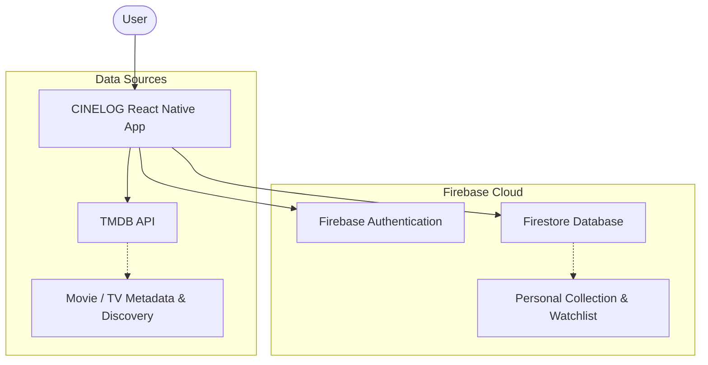

<div align="center">

# 🎬 CINELOG
### Movie & TV Series Tracker

**Track what you watch. Rate what you love. Discover what to watch next.**

Track movies and TV series you've watched, rate your favorites, manage your watchlist, and discover what's trending — all in one cinematic personal watch tracker.

[](https://opensource.org/licenses/MIT)
[](https://reactnative.dev/)
[](https://expo.dev/)
[](https://www.typescriptlang.org/)
[](https://firebase.google.com/)
[](https://www.themoviedb.org/)

[Features](#-features) • [How it Works](#-how-it-works) • [Screenshots](#-screenshots) • [Tech Stack](#-tech-stack) • [Installation](#-getting-started)

</div>

---

## 📖 About

**CINELOG** is a polished, personal movie and TV series tracker built with React Native and Expo. Designed with a premium cinematic aesthetic (deep navy, amber/gold accents, minimal layout), the app empowers you to easily catalogue your viewing history.

Whether you want to remember that great film from last week, maintain a backlog of TV shows on your watchlist, or discover the top trending content across the globe, CINELOG keeps your entire filmography perfectly synchronized in the cloud.

## ✨ Features

- **🎬 Personal Collection**: Track movies and TV series you've watched in a dedicated cloud-synced library.
- **⭐ Personal Ratings**: Rate watched titles on a 0.0–10.0 scale using a beautifully custom-built slider.
- **🔖 Watchlist**: Save movies and TV series you want to watch later.
- **🔥 Trending Discovery**: Discover popular and trending movies and TV series across the globe.
- **🏆 Collection Statistics**: View an elegant dashboard summarizing your total watched count, total movies, total TV series, overall watch time, and top genres.
- **🔍 TMDB Search**: Instant, reliable search for any movie or TV series powered by the TMDB API.
- **☁️ Cloud Sync**: Keep your collection synchronized seamlessly across devices through Firebase Cloud Firestore.
- **🔐 Google Sign-In**: Quick and secure authentication using Firebase Authentication.

## 📱 Screenshots

<!-- Add screenshots here -->
<div align="center">
  <p><i>(Screenshots illustrating Home, Collection, Watchlist, Details, Search, and Authentication will be added here.)</i></p>
</div>

## ⚙️ How It Works

1. **Sign In**: Authenticate securely using your Google account.
2. **Search**: Find a movie or TV series you're interested in using the integrated TMDB search.
3. **Open Details**: Tap any poster to view rich metadata, synopsis, and TMDB ratings.
4. **Log & Save**: Add it to your Personal Collection (if watched) or Watchlist (if saving for later).
5. **Rate**: Give watched titles a personal rating from 0.0 to 10.0.
6. **Track Statistics**: Visit your Home dashboard to view your lifetime watch hours and favorite genres.
7. **Discover**: Browse the "Popular" and "Trending" feeds to find your next favorite film.

## 🛠 Tech Stack

CINELOG is built using modern mobile development technologies:

| Technology | Purpose |
|------------|---------|
| **React Native** | Core framework for building native cross-platform mobile views. |
| **Expo** | Development platform & tooling (SDK 54). |
| **Expo Router** | File-based routing and bottom-tab navigation. |
| **TypeScript** | Strict typing for robust, error-free UI and state management. |
| **Firebase Auth** | Handles secure user authentication (Google Sign-In). |
| **Cloud Firestore** | NoSQL database storing user collections, watchlists, and ratings. |
| **TMDB API** | Fetches global movie and TV series metadata, posters, and trending lists. |
| **EAS Build** | Expo Application Services for remote native cloud compilation. |

## 🏗 Architecture



## 📂 Project Structure

```text
src/
├── app/            # Expo Router screens, layouts, and bottom tabs
├── components/     # Reusable UI components (MediaCards, RatingInput, etc.)
├── context/        # React Context (CinelogContext) for global state management
├── services/       # Firebase configuration and API logic
│   ├── firestore/  # Repositories for handling Firestore operations
│   └── tmdb/       # TMDB API fetching logic
├── constants/      # Theme colors, typography, and styling constants
└── types/          # TypeScript interfaces and models
```

## 🔒 Firebase & Security

User data is strictly scoped to the authenticated user's Firebase UID. 
The Firestore structure is designed as:
- `users/{uid}/media`
- `users/{uid}/watchlist`

**Security Rules:**
Firestore security rules are strictly implemented to ensure users can only read and write their own data:
```javascript
match /users/{userId}/{document=**} {
  allow read, write: if request.auth != null && request.auth.uid == userId;
}
```

## 🔑 Environment Variables

To run CINELOG locally, you must provide your own API keys. Create a `.env` file in the root directory:

```env
EXPO_PUBLIC_TMDB_API_KEY=your_tmdb_api_key_here
EXPO_PUBLIC_FIREBASE_API_KEY=your_firebase_api_key
EXPO_PUBLIC_FIREBASE_AUTH_DOMAIN=your_firebase_domain
EXPO_PUBLIC_FIREBASE_PROJECT_ID=your_firebase_project_id
EXPO_PUBLIC_FIREBASE_STORAGE_BUCKET=your_storage_bucket
EXPO_PUBLIC_FIREBASE_MESSAGING_SENDER_ID=your_messaging_sender_id
EXPO_PUBLIC_FIREBASE_APP_ID=your_app_id
EXPO_PUBLIC_GOOGLE_WEB_CLIENT_ID=your_google_web_client_id
```

> **Note:** Never commit your actual `.env` file or private credentials to version control. The repository includes a `.env.example` template.

## 🚀 Getting Started

### 1. Installation

Clone the repository and install dependencies:

```bash
git clone https://github.com/yourusername/cinelog.git
cd cinelog
npm install
```

### 2. Firebase Setup
1. Create a project in the Firebase Console.
2. Register an Android app and download your `google-services.json`, placing it in the root directory.
3. Enable **Google Sign-In** under Authentication providers.
4. Enable **Cloud Firestore** and deploy the rules located in `firestore.rules`.

### 3. Start Development Server

Run the Expo development server:

```bash
npx expo start
```

## 🛠 Validation & Development Commands

CINELOG relies on standard Expo and TypeScript validation tools:

- `npx tsc --noEmit` — Verifies all TypeScript typings across the project without emitting output files.
- `npx expo-doctor` — Diagnoses issues in the project configuration and dependency versions.
- `npx expo install --check` — Validates that installed packages match the required versions for the current Expo SDK.

## 📦 Builds

### Development Build
To compile the native app for testing on a physical Android device or emulator with native modules included:
```bash
eas build --profile development --platform android
```

### Production Build
To create a release-ready production build for Android:
```bash
eas build --profile production --platform android
```

## 🗺 Roadmap

- [ ] Advanced filtering, sorting, and tag management.
- [ ] More detailed watch statistics (e.g., viewing habits over time).
- [ ] Personalized recommendations based on top genres.
- [ ] iOS compilation and release.

## 🤝 Contributing

Contributions, issues, and feature requests are welcome! 
1. Fork the project.
2. Create your feature branch (`git checkout -b feature/AmazingFeature`).
3. Commit your changes (`git commit -m 'Add some AmazingFeature'`).
4. Push to the branch (`git push origin feature/AmazingFeature`).
5. Open a Pull Request.

## 📄 License

Distributed under the MIT License. See `LICENSE` for more information.

## 🎬 Attribution


This product uses the TMDB API but is not endorsed or certified by TMDB. All movie/TV metadata, posters, and imagery are provided by TMDB.

---

<div align="center">

### 🎬 CINELOG

**Track what you watch. Discover what comes next.**

Made with React Native, Expo, Firebase & TMDB.

</div>
